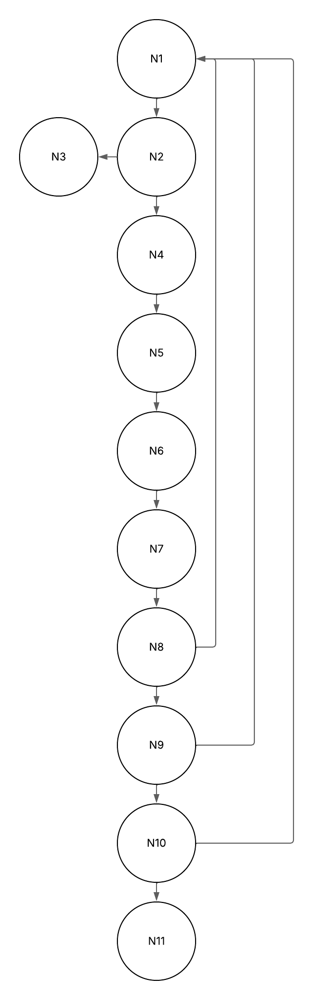

# Projeto Karatsuba

O **Karatsuba** é um projeto desenvolvido para implementar e analisar o **Algoritmo de Karatsuba**, uma técnica eficiente de multiplicação de números inteiros grandes. Este algoritmo reduz o custo computacional da multiplicação em comparação ao método tradicional, sendo especialmente útil para operações com números extensos.  

---

## Sobre o Algoritmo de Karatsuba  

O **algoritmo de Karatsuba** foi introduzido em 1960 por Anatolii Karatsuba e revolucionou a forma como multiplicações grandes são tratadas.  
Enquanto o método tradicional possui complexidade **O(n²)**, o Karatsuba reduz essa complexidade para aproximadamente **O(n^log₂3) ≈ O(n^1.585)**, tornando-se muito mais eficiente para números grandes.  

A ideia central é dividir os números em duas partes e realizar apenas **três multiplicações recursivas**.  

---

## Diferença entre Complexidade Assintótica e Complexidade Ciclomática  

- **Complexidade Assintótica:** mede o desempenho do algoritmo conforme o tamanho da entrada cresce.    

- **Complexidade Ciclomática:** mede a quantidade de caminhos independentes no código-fonte, importante para avaliar a necessidade de testes.  

---

## Como Executar o Projeto  

### 1. Clonar o repositório  
```bash
git clone https://github.com/Eduuhms/FPAA.git
cd Karatsuba
```

### 2. Executar o programa  
```bash
python main.py
```

O programa solicitará dois números ao usuário e exibirá o resultado da multiplicação utilizando o algoritmo de Karatsuba.  

---

## Versão do Python  

Este projeto foi desenvolvido e testado na versão **Python 3.13.5**.  

---


## Estrutura do Projeto

O projeto está organizado da seguinte forma:

### Arquivos Principais

- **karatsuba.py**
  - Implementa a função `karatsuba(x, y)` responsável pela multiplicação eficiente de dois inteiros grandes usando o algoritmo de Karatsuba.

- **main.py**
  - Realiza a interação com o usuário: solicita dois números inteiros, utiliza a função `karatsuba` para multiplicá-los e exibe o resultado.

### Funções

- **`karatsuba(x, y)`**
  - Parâmetros: dois inteiros `x` e `y`.
  - Retorno: resultado da multiplicação usando o algoritmo de Karatsuba.
  - Lógica:
    1. Caso base: se `x` ou `y` forem menores que 10, retorna a multiplicação direta.
    2. Divide os números em partes alta e baixa.
    3. Realiza três multiplicações recursivas: `r0`, `r1` e `r2`.
    4. Combina os resultados usando a fórmula de Karatsuba.

- **`main`**
  - Solicita dois números ao usuário.
  - Chama a função `karatsuba(x, y)`.
  - Exibe o resultado formatado.

---

## Relatório Técnico  

### Complexidade Assintótica  
- **Tempo:** 
  - Melhor caso: O(1), quando os números são pequenos (< 10).  
  - Caso médio: O(n^log(3)) ≈ O(n^1.585).  
  - Pior caso: O(n^log(3)) ≈ O(n^1.585).  

- **Espaço:** 
  - O(n^log(3))

### Complexidade Ciclomática 
  - **Fluxo de controle:**

    1. Início da função.
    2. Verifica se x < 10 ou y < 10.
      - Se verdadeiro: retorna x * y (multiplicação direta).
      - Se falso: segue para o próximo passo.
    3. Calcula o número de dígitos de x e y (n = max(len(str(x)), len(str(y)))).
    4. Calcula o ponto de divisão dos números (m = n // 2).
    5. Divide x em parte alta e baixa (high_x, low_x = divmod(x, 10**m)).
    6. Divide y em parte alta e baixa (high_y, low_y = divmod(y, 10**m)).
    7. Chama recursivamente karatsuba para as partes baixas: r0 = karatsuba(low_x, low_y).
    8. Chama recursivamente karatsuba para as somas das partes: r1 = karatsuba((low_x + high_x), (low_y + high_y)).
    9. Chama recursivamente karatsuba para as partes altas: r2 = karatsuba(high_x, high_y).
    10. Combina os resultados usando a fórmula de Karatsuba e retorna o valor final.

  - **Nós:**
    - **N1:** Início da função karatsuba 
    - **N2:** Verificação do if do caso base 
    - **N3:** Retorno da multiplicação direta 
    - **N4:** Cálculo do número de dígitos de x e y 
    - **N5:** Divide o número de dígitos no meio
    - **N6:** Divisão de x em parte alta e baixa 
    - **N7:** Divisão de y em parte alta e baixa 
    - **N8:** Primeira chamada recursiva (para as partes baixas) 
    - **N9:** Segunda chamada recursiva (para as somas das partes) 
    - **N10:** Terceira chamada recursiva (para as partes altas) 
    - **N11:** Combinação dos resultados e retorno final 

  - **Arestas:**
    - **A1:** N1 → N2 (Início vai para verificação do caso base)
    - **A2:** N2 → N3 (Se condição do caso base for verdadeira, vai para retorno direto)
    - **A3:** N2 → N4 (Se condição do caso base for falsa, segue para cálculo do número de dígitos) 
    - **A4:** N4 → N5 (Após cálculo do número de dígitos, vai para divisão ao meio)
    - **A5:** N5 → N6 (Após divisão ao meio, vai para divisão de x)
    - **A6:** N6 → N7 (Após divisão de x, vai para divisão de y)
    - **A7:** N7 → N8 (Após divisão de y, vai para chamada recursiva r0)
    - **A8:** N8 → N9 (Após r0, vai para chamada recursiva r1)
    - **A9:** N9 → N10 (Após r1, vai para chamada recursiva r2)
    - **A10:** N10 → N11 (Após r2, vai para combinação dos resultados e retorno final)
    - **A11:** N8 → N1 (Primeira chamada recursiva para karatsuba)
    - **A12:** N9 → N1 (Segunda chamada recursiva para karatsuba)
    - **A13:** N10 → N1 (Terceira chamada recursiva para karatsuba)

  - **Grafo da função:**

  
       
  
  - **Calculo da complexidade Ciclomática:**
    - **Fórmula:** 
      - 𝑀 = 𝐸 − 𝑁 + 2𝑃
      - M = 13 - 11 + 2 * 1 (apenas um componente conexo)
      - M = 4
---

## Documentação Linha a Linha  

## Arquivo: karatsuba.py  

- **Linha 1:** `def karatsuba(x: int, y: int) -> int:` → Definição da função de multiplicação de Karatsuba  
- **Linha 3:** `if x < 10 or y < 10:` → Caso base: se x ou y forem menores que 10, retorna a multiplicação direta  
- **Linha 4:** `return x * y` → Multiplicação direta  
- **Linha 6:** `n = max(len(str(x)), len(str(y)))` → Converte os números em string para obter a quantidade de dígitos e armazena a maior entre x e y  
- **Linha 7:** `m = n // 2` → Divide o número de dígitos no meio  
- **Linha 9:** `high_x, low_x = divmod(x, 10**m)` → Divide x em parte alta e baixa  
- **Linha 10:** `high_y, low_y = divmod(y, 10**m)` → Divide y em parte alta e baixa  
- **Linha 12:** `r0 = karatsuba(low_x, low_y)` → Primeira chamada recursiva, multiplicação da parte baixa  
- **Linha 13:** `r1 = karatsuba((low_x + high_x), (low_y + high_y))` → Segunda chamada recursiva, multiplicação das somas das partes  
- **Linha 14:** `r2 = karatsuba(high_x, high_y)` → Terceira chamada recursiva, multiplicação da parte alta  
- **Linha 16:** `return (r2 * 10**(2*m)) + ((r1 - r2 - r0) * 10**m) + r0` → Combina os resultados usando a fórmula de Karatsuba  

---

## Arquivo: main.py  

- **Linha 1:** `from karatsuba import karatsuba` → Importa a função `karatsuba` do arquivo karatsuba.py  
- **Linha 3:** `if __name__ == "__main__":` → Ponto de entrada do programa  
- **Linha 5:** `a = int(input("Digite o primeiro número: "))` → Solicita o primeiro número ao usuário  
- **Linha 6:** `b = int(input("Digite o segundo número: "))` → Solicita o segundo número ao usuário  
- **Linha 8:** `resultado = karatsuba(a, b)` → Chama a função de Karatsuba para multiplicar os números  
- **Linha 9:** `print(...)` → Exibe o resultado da multiplicação  

---

## Exemplo de Execução  

```bash
Digite o primeiro número: 123456789
Digite o segundo número: 987654321

Resultado da multiplicação usando Karatsuba:
123456789 * 987654321 = 121932631112635269
```

---


## Referência  

- [Algoritmo de Karatsuba - Kuniga Blog](https://kuniga.wordpress.com/2011/07/03/algoritmo-de-karatsuba/) 