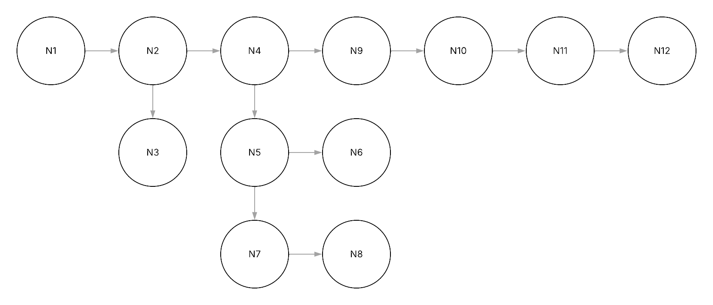
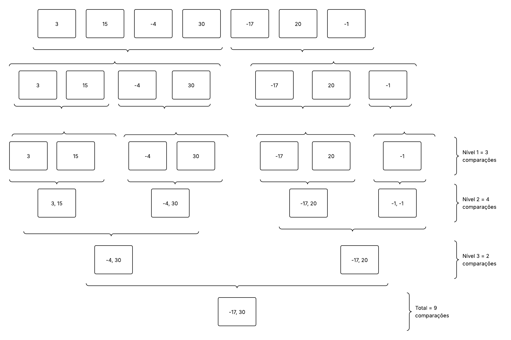

# Projeto MaxMin Select

O **MaxMin Select** é um projeto desenvolvido para implementar e analisar o **Algoritmo de Seleção Simultânea do Maior e do Menor Elemento**, utilizando a técnica de **Divisão e Conquista**.  

---

## Sobre o Algoritmo MaxMin Select  

O **algoritmo MaxMin Select** tem como objetivo encontrar simultaneamente o **menor** e o **maior** elemento de uma lista de números, com menos comparações do que uma abordagem ingênua (que faria duas varreduras na lista).  

A ideia central é:  
1. **Dividir** o problema em duas partes (sublistas).  
2. **Resolver** cada subproblema recursivamente, obtendo `(min_esq, max_esq)` e `(min_dir, max_dir)`.  
3. **Combinar** os resultados para encontrar o menor e o maior global.  

Enquanto o método ingênuo precisa de cerca de `2n` comparações, o MaxMin Select reduz esse número para aproximadamente `3n/2` comparações.  

---

## Como Executar o Projeto  

### 1. Clonar o repositório  
```bash
git clone https://github.com/Eduuhms/FPAA.git
cd MaxMin Select
```  

### 2. Executar o programa  
```bash
python main.py
```

O programa solicitará que o usuário digite uma lista de números separados por espaço.  
Exemplo de execução:  

```bash
Digite os números da lista separados por espaço: 7 3 9 1 14 6 
Lista informada: [7, 3, 9, 1, 14, 6]
Menor elemento: 1
Maior elemento: 14
```

---

## Versão do Python  

Este projeto foi desenvolvido e testado na versão **Python 3.13.5**.  

---

## Estrutura do Projeto

### Arquivos Principais

- **maxmin.py**  
  - Implementa a função recursiva `maxmin_select(arr, inicio, fim)` responsável por encontrar o menor e o maior elemento da lista.  

- **main.py**  
  - Realiza a interação com o usuário: solicita uma lista de números inteiros, utiliza a função `maxmin_select` e exibe os resultados.  

### Funções

- **`maxmin_select(arr, inicio, fim)`**  
  - Parâmetros: lista de inteiros `arr`, índices `inicio` e `fim`.  
  - Retorno: tupla `(minimo, maximo)`.  
  - Lógica:  
    1. Caso base 1: apenas um elemento → retorna `(arr[i], arr[i])`.  
    2. Caso base 2: dois elementos → compara e retorna `(menor, maior)`.  
    3. Caso geral: divide a lista ao meio, resolve recursivamente e combina os resultados.  

---

## Relatório Técnico  

### Análise de Complexidade Assintótica — Contagem de Comparações  

#### Recorrência do número de comparações
Seja `C(n)` o número total de comparações para um array de tamanho `n`:  

- Caso base 1:  
  `C(1) = 0` (nenhuma comparação, pois o único elemento é min e max).  
- Caso base 2:  
  `C(2) = 1` (uma única comparação entre os dois elementos).  
- Caso geral (n > 2):  
  \[
  C(n) = C(n/2) + C(n/2) + 2
  \]  
  ou seja:  
  \[
  C(n) = 2C(n/2) + 2
  \]  

### Resolução da Recorrência
Cada divisão gera **duas subchamadas** de tamanho `n/2`.  
Cada etapa de combinação exige apenas **2 comparações constantes**.  

Logo, o crescimento de `C(n)` é proporcional a `n`.  

**Conclusão:**  
\[
C(n) = O(n)
\]  

---

### Análise pelo Teorema Mestre  

  A recorrência tem a forma:  

\[
T(n) = aT(n/b) + f(n)
\]

Comparando com o problema:  

- \( a = 2 \)  (duas chamadas recursivas)  
- \( b = 2 \)  (cada chamada é feita com metade do array)  
- \( f(n) = O(1) \)  (trabalho fora da recursão é constante: 2 comparações)  

Agora, calculamos:  

\[
\log_b(a) = \log_2(2) = 1
\]  

E temos:  
- \( d = 0 \), pois \( f(n) = O(1) = O(n^0) \).  
- Como \( d = 0 < 1 = \log_b(a) \), caímos no **Caso 1 do Teorema Mestre**.  

Portanto:  

\[
T(n) = O(n^{\log_b(a)}) = O(n^1) = O(n)
\]  


---
## Grafos
### Grafo de controle de fluxo


### Grafo divisão e combinação

---
## Documentação Linha a Linha  

### Arquivo: maxmin.py  

- **Linha 1:** `def maxmin_select(arr, inicio, fim):` → Define a função recursiva.  
- **Linha 4:** Caso base com 1 elemento. 
- **Linha 5:** Retorna o único elemento como mínimo e máximo 
- **Linha 8:** Caso base com 2 elementos → compara e retorna `(menor, maior)`.  
- **Linha 9:** Compara os dois elementos
- **Linha 10:** Retorna na ordem (mínimo, máximo)
- **Linha 11:** Compara os dois elementos
- **Linha 12:** Retorna na ordem (mínimo, máximo)
- **Linha 15:** Calcula o índice do meio.  
- **Linha 16:** Chamada recursiva para metade esquerda.  
- **Linha 17:** Chamada recursiva para metade direita.  
- **Linha 20:** Combina e retorna os resultados usando `min(...)` e `max(...)`.  

### Arquivo: main.py  

- **Linha 1:** Importa a função `maxmin_select`.  
- **Linha 3:** Ponto de entrada do programa.  
- **Linha 5:** Solicita ao usuário os números separados por espaço.  
- **Linha 6:** Converte a entrada em lista de inteiros.  
- **Linha 8:** Exibe a lista informada.  
- **Linha 10:** Chama `maxmin_select` para processar os dados.  
- **Linha 12-13:** Imprime o menor e o maior elemento.  

---

## Exemplo de Execução  

```bash
Digite os números da lista separados por espaço: 10 22 5 99 1 17
Lista informada: [10, 22, 5, 99, 1, 17]
Menor elemento: 1
Maior elemento: 99
```

---

## Referências  
- [Aula sobre Complexidade de Algoritmos – Edirlei.com](https://edirlei.com/aulas/paa_2017_1/PAA_Aula_01_Complexidade_Algoritmos_2017.html)
  
- [Teorema Mestre – Blog Cyberini](https://www.blogcyberini.com/2017/11/teorema-mestre.html)
